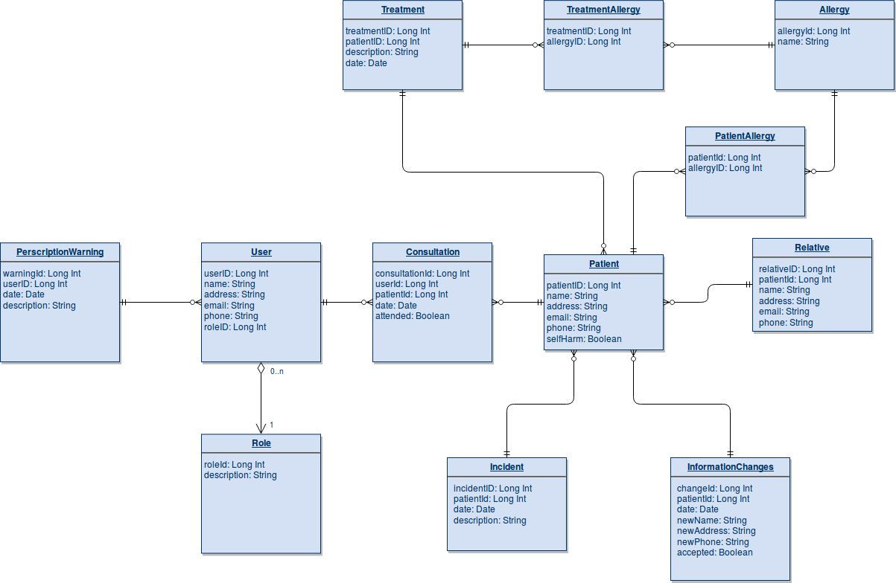

# EPL441Clinic

Final Project for EPL441 - Advanced Software Engineering

## For Development

### Install Necessary Eclipse Plug-Ins.
1. Installing Eclipse Plug-In Development Environment(Necessary for developing OSGi Bundles): 
```
Help-> Install New Software... -> Work with: --All Available Sites-- --> Select Eclipse Plug-In Development Environment --> Install
```
2. Installing Bndtools(Necessary for using bnd, tool that makes OSGi development easier, and using the [bnd workspace model](https://bndtools.org/concepts.html).
```
Help-> Install New Software... -> Work with: --All Available Sites-- --> Select Bndtools and all subplug-ins --> Install
```

### Install Gradle
[Gradle](https://gradle.org/) is the tool that we will use to build the project(instead of ant/maven) as it is the requirement for the Project to have a build script.


### Setting Up Workspace

1. Clone the repository by running.

```bash
git clone https://github.com/npafitis/EPL441Clinic.git <path-to-your-workspace-name>
```

2. The repository you just cloned will be the workspace that you are going to use in Eclipse. Set the Eclipse workspace to that repository. Now, in your package explorer you should only see a cnf folder

### Creating an OSGi Bundle

1. New Project (Wizard).

2. Under Bndtools select Bnd OSGi Project, then Next.

3. Select Empty Template. (Will investigate later if any of the OSGi R7 enRoute templates are more fitting)

4. Create Project.

### Setting Up MySQL DataBase

Database has been set up using docker to avoid any installation/configuration problems across different team members. A __docker-compose.yml__ file with a MySQL image.

1. Install [Docker](https://www.docker.com/)

2. Run in terminal

```bash
docker-compose up
```

The database must be running now.

Optional:

3.  Install [MySQL Workbench](https://www.mysql.com/products/workbench/) for IDE interface to MySQL.

4. Open MySQL Workbench.

5. Create a new Connection with the following settings

```
Host: 0.0.0.0
port: 33061
username: homestead
```

### Migrating Database(Creating DataBase Schema)
For *nix Systems run the following
```bash
sudo ./gradlew run.cy.ac.ucy.epl441.migration
```

For Windows Systems run __gradlew.bat__ instead with the same arguments.

Password is: __secret__

## Database Schema



## Building Project Applications
To build all Application Project in the workspace run

```bash
./gradlew
```
